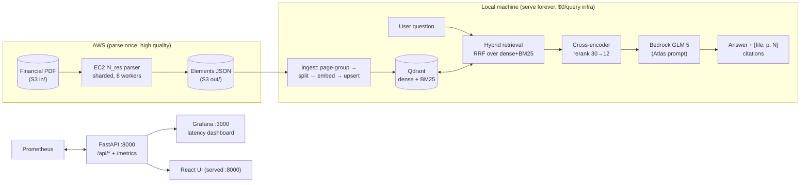

# Production RAG over Financial PDFs

Ask questions about 100+ page financial reports and get answers with **exact numbers, units, periods, and page citations** — or an honest "not in the excerpts" instead of a hallucination.

Built on a real corpus: a 143-page financial report (8,135 parsed elements, 1,312 indexed chunks), tuned over **13 documented experiments** in [`EXPERIMENTS.md`](EXPERIMENTS.md).

## 1. High-level architecture



**The two-stage trick that makes this fast *and* accurate:** high-quality PDF parsing (`hi_res` layout + table structure) is slow on CPU (~30 s/page) but only needs to run **once per document**. So parsing runs on a beefy EC2 box, the structured elements land in S3, and everything else — chunking, embeddings, search, answering — runs locally and cheaply. The EC2 box stays **stopped** when idle (EBS keeps the setup). Details in [§7](#7-aws-pdf-parsing-path).

**Query path (every `/api/ask`):**

```
question → bge-m3 dense + BM25 sparse → Qdrant RRF (prefetch 20+20)
  → top-30 → bge-reranker-v2-m3 → top-12 → GLM 5 → answer + sources
```

**Ingest path:** EC2 elements (or local PDF) → drop Header/Footer → one doc per page + standalone table docs → split (prose 1000/200 chars, tables by row with header repeated) → bge-m3 + BM25 embed → Qdrant upsert (batched, idempotent per-source).

## 2. Features

- **Multi-column PDFs, correct reading order** — `hi_res` layout model instead of naive text extraction (which produced 83% sub-100-char crumbs and **zero** tables on this corpus).
- **Tables survive as tables** — HTML grids become captioned Markdown with column names, row labels, FY aliases (`FY2026` ↔ `year ended 31st March, 2026`), and headers repeated in every row-split chunk. The exact query that failed for 7 experiments now cites both FY26 and FY25 revenue correctly.
- **Hybrid retrieval + rerank, composed** — dense alone left the key revenue page at rank ~25; hybrid took it to 7; rerank to 1. Both stay on.
- **Grounded answers with page citations** — every factual claim cited as `[filename, p. N]`; numbers quoted exactly, no silent currency conversion; conflicting excerpts presented side-by-side.
- **Honest refusals** — off-topic or unanswerable questions get a plain decline (2/2 refusal probes pass), not a guess.
- **Clickable citations in the UI** — citation pills with hover tooltips showing the source excerpt.
- **Observability built in** — Prometheus latency-per-step (`retrieve`/`rerank`/`generate`/HTTP) + Grafana dashboard; this is how we found CPU rerank (60–185 s/30 docs) dominating latency.
- **Eval-gated changes** — 10-probe own suite + 20-probe verified user suite (RAGAS + deterministic number/page checks). No tuning ships without beating the baseline.

## 3. Tech stack

| Layer | Choice |
|---|---|
| LLM | GLM 5 (`zai.glm-5`) via Bedrock Converse API (`langchain-aws`) |
| Dense embeddings | bge-m3 (1024-dim) via local Ollama — unlimited, no quota |
| Sparse retrieval | BM25 (`fastembed Qdrant/bm25`), fused with dense via Qdrant RRF |
| Reranker | `BAAI/bge-reranker-v2-m3` CrossEncoder, top-30 → top-12 |
| Vector DB | Qdrant (Docker, named vectors `dense` + `bm25`) |
| PDF parsing | `unstructured` `hi_res` on EC2 (layout + table transformer); `fast` locally for quick docs |
| Backend | FastAPI (Python 3.12, `uv`), background ingest jobs with progress polling |
| Frontend | React 19 + Vite + Tailwind 4 + `react-markdown`, served from `:8000` |
| Observability | Prometheus `:9090` + Grafana `:3000` (both in `docker-compose.yml`) |
| Eval | RAGAS (<0.4, GLM judge + bge-m3 judge embeddings) + deterministic checks |
| Fallback embed providers | Bedrock Titan v2, Gemini `gemini-embedding-001`, Cohere Embed v3 (all wired, see E5 for why local won) |

## 4. Assumptions & engineering decisions

Each decision was earned by an experiment (E-numbers → [`EXPERIMENTS.md`](EXPERIMENTS.md)). Summary:

| Decision | Why (experiment) |
|---|---|
| Parse with `hi_res` on EC2, not `fast` locally | E1: `fast` gave 83% crumbs, 0 tables on a financial report — unacceptable where tables are the content |
| Sharded parallel parse, spawn workers, warmed HF cache | E2: fix list for rate-limits, fork-crashes, missing tesseract on AL2023 |
| Accept ~11 min full-doc CPU parse; GPU later | E3: 667 s at 92% parallel efficiency — no scheduling fix left on CPU; only cheaper-work-per-page (GPU) moves it |
| Page-grouped chunks, drop Header/Footer | E4: element shattering persisted crumbs into Qdrant; page docs → median 811-char chunks |
| bge-m3 local embeddings | E5+E7: Titan throttles, Gemini free tier blown, Cohere needs a payment instrument; bge-m3 ranked gold pages 7/2/1 vs nomic's ~25+ |
| Tables as captioned Markdown grids, header repeated per row-chunk, FY aliases | E6: flat text destroyed column alignment; HTML was tag soup for embeddings; each of the three properties proven necessary by ablation |
| Keep hybrid AND rerank | E8+E10: hybrid 7→1 on the revenue probe; rerank +0.19 context precision — they compose |
| `TOP_K` 12 (was 8) | E13: p.131's correct loan table sat at rank 9–12; widening flipped a wrong answer (224.07) to the right one (25,710.80), no regressions |
| No query expansion | E12: appending FY long-forms boosted *every* table (we index FY aliases everywhere) and sank the PAT probe 1→14 — dropped, code reverted |
| Deterministic number/page checks as primary gate | E10/E11: LLM-judge noise is ±0.1 run-to-run; 4 of 5 "misses" turned out to be wrong gold pages / duplicate content, proven by manual audit |

## 5. Experiment record (real metrics)

Full lab log: [`EXPERIMENTS.md`](EXPERIMENTS.md). Headlines:

| Suite | Faithfulness | Relevancy | Precision | Recall | Extras |
|---|---|---|---|---|---|
| Own 10, rerank ON (E10) | 0.710 | 0.941 | **0.926** (was 0.736) | 0.750 | refusals 2/2 |
| User 20 (E11, +alt-page fix) | 0.906 | 0.756 | 0.594 → pages **0.90** after gold correction | 0.800 | numbers 0.65 |

Key plots in words: E8 revenue rank 25 → 7 → 1 across dense → hybrid → rerank. E12 expansion 1 → 14 (reverted). E13 TOP_K-12 rescues p2-q4. Rerank costs 60–185 s per 30-doc query on CPU — the known latency hog (GPU quota case open).

## 6. Setup & run

Prereqs: Python 3.12+ (`uv`), Docker, Ollama, AWS Bedrock access for `zai.glm-5`.

```powershell
# 1. Infra (Qdrant + Prometheus + Grafana)
docker compose up -d
# Qdrant: http://localhost:6333/dashboard | Prometheus: :9090 | Grafana: :3000 (admin/admin)

# 2. Embeddings brain
ollama serve
ollama pull bge-m3

# 3. Env + backend
copy .env.example .env   # set AWS_BEARER_TOKEN_BEDROCK
uv sync
uv run uvicorn app.main:app --reload --port 8000
# UI: http://localhost:8000 | API docs: /docs | Metrics: /metrics | Health: /health
```

One-time model warmup so uploads never wait on downloads:

```powershell
uv run python -m app.warmup
```

Key `.env` knobs: `EMBED_PROVIDER=ollama`, `OLLAMA_EMBED_MODEL=bge-m3`, `TOP_K=12`, `HYBRID_SEARCH=true`, `HYBRID_PREFETCH=20`, `RERANK=true`, `RERANK_TOPN=30`, `UNSTRUCTURED_STRATEGY=fast`.

## 7. AWS PDF-parsing path

Why: `hi_res` needs ~30 s/page on CPU — 143 pages ≈ 11 min single box, and local laptops shouldn't pay that. So: parse big PDFs on EC2 once, serve locally forever.

```powershell
# 1. Start the parked extractor box (keep EBS, stop when done)
aws ec2 start-instances --instance-ids i-09f713876327b16b5

# 2. On EC2: sharded hi_res parse (extractor/shard_compare.py) -> S3 s3://rag-extract-*/out/
# 3. Locally: download elements JSON, ingest without re-parsing:
#    POST /api/upload-preparsed  (ingest_elements: group -> split -> embed -> upsert)
# 4. Stop the box
aws ec2 stop-instances --instance-ids i-09f713876327b16b5
```

S3 layout: `s3://rag-extract-<acct>-use1/in/` (PDFs) + `/out/` (elements JSON). Upserts are idempotent per source — re-ingesting replaces, never duplicates. When the GPU quota case lands, step 2 gets re-measured on `g4dn.xlarge`.

## 8. API

| Method | Path | Purpose |
|---|---|---|
| GET | `/health` | backend + Qdrant + chunk count (also sets `rag_qdrant_up`) |
| POST | `/api/upload` | PDF → 202 + `{job_id}`, background ingest |
| GET | `/api/jobs/{job_id}` | poll `queued → processing → completed/failed` + step + progress |
| POST | `/api/ask` | `{"question": "...", "top_k": 12}` → answer + sources |
| GET | `/api/stats` | chunk count + files |
| DELETE | `/api/documents` | wipe collection |
| GET | `/metrics` | Prometheus scrape endpoint |

## 9. Eval & observability

```powershell
uv run python evals/run_evals.py          # own 10-probe suite
uv run python evals/run_user_eval.py      # user 20-probe suite (cached, resumable)
uv run python evals/run_user_eval.py --ids p1-q5,p2-q4   # subset
```

Prometheus queries that matter:

```
histogram_quantile(0.95, sum by (le, step) (rate(rag_step_seconds_bucket[5m])))  # p95/step
sum by (step) (rate(rag_errors_total[5m]))                                       # errors/step
```

## 10. Project structure

```
app/            # FastAPI backend: main.py, rag.py (pipeline), metrics.py, jobs.py, config.py
extractor/      # EC2 scripts: shard_compare.py, compare.py, probe.py
evals/          # golden.py, run_evals.py, run_user_eval.py, results/
frontend/       # React 19 UI (build dist/ to go live)
prometheus/     # scrape config | grafana/provisioning/  # datasource + RAG dashboard
HANDOFF.md      # current state, metrics dashboard, next actions
EXPERIMENTS.md  # E1–E13 lab log — read this before changing anything
```

## 11. Troubleshooting

- Steps + traces: `./logs/rag.log` (`timestamp | LEVEL | rag | step | message`); failures log `FAILED step=<name>`.
- `Qdrant not reachable` → `docker compose up -d`.
- Bedrock `AccessDenied` → enable Model Access for `zai.glm-5`, check region/key.
- `1024-dim mismatch` → embed model changed after ingest; `DELETE /api/documents`, re-upload.
- bge-m3 NaN on rare token combos → automatic BM25-only fallback (logged); answer still served.
- Slow asks → check Grafana: CPU rerank of 30 docs is 60–185 s; GPU quota is the structural fix.
