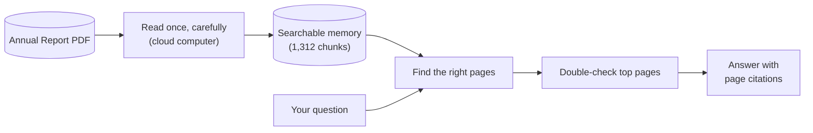

# Production RAG for Company Annual Reports

Upload a company's annual report (100+ pages) and ask questions in plain English. You get answers with **exact numbers and page citations** — or an honest "not in the report" instead of a made-up answer.

**Example:**

> **You:** What dividend per share did the board recommend for FY 2025-26?
>
> **Atlas:** ₹0.60 per equity share of ₹10 each, for the year ended March 31, 2026 [report.pdf, p. 3]. Subject to shareholder approval.

## How it works

```
1. READ    Upload a PDF → the system reads it once, carefully
           (columns in the right order, tables kept as tables)
2. STORE   It remembers everything in a searchable database (1,312 chunks for a 143-page report)
3. ASK     Ask anything → it finds the right pages, double-checks them,
           and answers with [file, page] citations
```



Big reports are read on a powerful cloud computer (once per document), everything else runs on your own machine — so answering questions is fast and costs almost nothing.

## Why it's good

- **Reads tables properly.** Financial reports *are* tables. Most tools mangle them; this one keeps rows, columns, years (FY2026 vs FY2025), and units (crore, lakh) intact.
- **Shows its work.** Every number comes with the page it came from. Click a citation in the chat to see the source.
- **Says "I don't know."** If the report doesn't contain the answer, it says so instead of guessing.
- **Tested, not vibes.** 30 test questions with verified answers. Scores published below — every improvement had to beat them first.

## Proof it works

30 test questions against a real 143-page financial report:

| What we measure | Score |
|---|---|
| Answers grounded in the report (faithfulness) | 0.91 / 1.00 |
| Right pages found | 18 / 20 |
| Numbers exactly right | 13 / 20 |
| Trick questions correctly refused | 2 / 2 |

 Known weak spot: exact-number questions (13/20) — tables with near-identical figures across years.

### What we tried (13 experiments so far)

| # | What we tried | What happened | Verdict |
|---|---|---|---|
| 1–3 | Cheap vs careful PDF reading | Cheap reading found **0 tables**; careful reading found 277 (takes ~11 min, once per file) | ✅ Careful reading |
| 4 | Smarter chunking | Stopped 83% of chunks being useless fragments | ✅ Shipped |
| 5–7 | Which search engine understands finance best | Winner (bge-m3) put the right page at rank 7/2/1 vs 25+ for the runner-up | ✅ Shipped |
| 8 | Combine meaning-search + keyword-search | Key revenue page jumped from rank 7 → **1** | ✅ Shipped |
| 9–10 | Add a double-check step (reranker) | Correct-page rate +0.19 (0.736 → **0.926**) | ✅ Shipped |
| 11 | Test on 20 hand-verified questions | Found 4 test-sheet page numbers were wrong, not the search — fixed the test, pages 0.65 → **0.90** | ✅ Fixed |
| 12 | Auto-expand shorthand (FY26, PAT…) in questions | Made one answer **worse** (rank 1 → 14) — extra year-words confused every table equally | ❌ Dropped |
| 13 | Show the answer-writer 12 pages instead of 8 | Fixed a wrong loan figure (₹224 → ₹25,710 cr), nothing got worse | ✅ Shipped |

The full diary with all numbers is in [`EXPERIMENTS.md`](EXPERIMENTS.md).

## Tech stack

| Piece | What we use | Why |
|---|---|---|
| Answer writer | GLM 5 (via AWS Bedrock) | Follows strict "cite or decline" instructions |
| Search | bge-m3 + keyword search, combined | Understands meaning *and* exact terms like ₹1,560.90 |
| Double-check | bge-reranker-v2-m3 | Re-reads top candidates, keeps the best 12 |
| Memory | Qdrant database | Fast similarity search over thousands of chunks |
| PDF reading | Unstructured `hi_res` on AWS | Correct column order + table structure |
| App | Python/FastAPI backend, React chat UI | Upload PDFs, ask, browse sources |
| Monitoring | Prometheus + Grafana | Tracks speed of each step |

## Try it yourself

```powershell
# 1. Start the database + monitoring
docker compose up -d

# 2. Start the search engine + app (two terminals)
ollama serve
uv run uvicorn app.main:app --reload --port 8000
```

Open **http://localhost:8000** → upload a PDF → ask away.

You'll need an AWS key for the answer-writer model — copy `.env.example` to `.env` and paste it in.

## For developers

- **API:** `POST /api/upload` (PDF) → `GET /api/jobs/{id}` (progress) → `POST /api/ask` (question) → answer + sources. Docs at `/docs`.
- **Tests:** `uv run python evals/run_user_eval.py` (20 verified questions).
- **Dashboard:** Grafana at `:3000` shows per-step speed; Prometheus at `:9090`.
- **Project map:** `app/` (backend) · `frontend/` (chat UI) · `extractor/` (cloud PDF scripts) · `evals/` (tests) · [`HANDOFF.md`](HANDOFF.md) (current state) · [`EXPERIMENTS.md`](EXPERIMENTS.md) (why things are the way they are).
