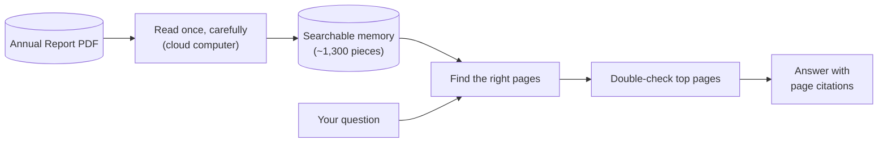
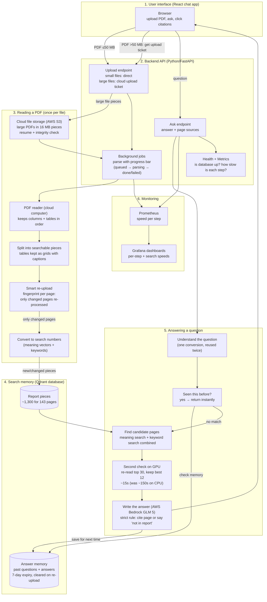

# Production AI Search over Company Annual Reports

Upload a company's annual report (100+ pages) and ask questions in plain English. You get answers with **exact numbers and page citations** — or an honest "not in the report" instead of a made-up answer.

> *Recruiter summary: this is a document Q&A app. It reads long financial PDFs once, stores what it learned in a search database, and answers questions with page references. It is built to handle large files, repeat questions fast, and run reliably in production.*

**Example:**

> **You:** What dividend per share did the board recommend for FY 2025-26?
> *(FY = financial year, April–March in India)*
>
> **Atlas:** ₹0.60 per equity share of ₹10 each, for the year ended March 31, 2026 [report.pdf, p. 3]. Subject to shareholder approval.

## How it works (plain English)

```
1. READ    Upload a PDF → the system reads it once, carefully
           (columns in the right order, tables kept as tables)
2. REMEMBER It saves everything in a searchable database
           (~1,300 searchable pieces for a 143-page report)
3. ASK     Ask anything → it finds the right pages, double-checks them,
           and answers with [file, page] citations
```


```mermaid
flowchart LR
    PDF[("Annual Report PDF")] --> READ["Read once, carefully<br/>(cloud computer)"]
    READ --> DB[("Searchable memory<br/>(~1,300 pieces)")]
    DB --> FIND["Find the right pages"]
    FIND --> CHECK["Double-check top pages"]
    CHECK --> ANSWER["Answer with<br/>page citations"]
    Q["Your question"] --> FIND
```

Big reports are read on a powerful cloud computer (once per document); answering questions runs on your own machine — so answers are fast and cost almost nothing. The full technical diagram is in [System architecture](#system-architecture) below.

## Why it's good

- **Reads tables properly.** Financial reports *are* tables. Most tools mangle them; this one keeps rows, columns, years (FY2026 vs FY2025), and units (crore = 10M, lakh = 100K) intact.
- **Shows its work.** Every number comes with the page it came from. Click a citation in the chat to see the source.
- **Says "I don't know."** If the report doesn't contain the answer, it says so instead of guessing.
- **Tested, not vibes.** 30 test questions with human-verified answers. Scores published below — every improvement had to beat them first.

## Built for production, not just a demo

- **Survives cloud hiccups.** Calls to paid AI services retry automatically (up to 6 attempts) — but *only* for "too busy, try again" errors. Real errors (wrong key, unknown model) fail fast and loud instead of being hidden by retries.
- **Switch AI providers with one setting.** Search runs locally by default (free, unlimited), but one config line switches to AWS, Google, or Cohere hosted models. The database rebuilds itself automatically when the switch changes data shapes, and batched + paced requests keep bills and throttling under control.
- **Graded like software, not vibes.** Two test suites (10 + 20 human-verified questions) run on every change: an AI judge scores groundedness/relevance, and strict checks verify exact numbers and page citations. Results are cached, resumable, and compared against the previous run.
- **Cloud-friendly by design.** Reliable API in Docker (restarts cleanly, no local state), background uploads with progress bar, health checks + speed tracking, one-command dashboards, and heavy PDF reading offloaded to disposable cloud machines that shut down when idle.
- **Answers repeat questions instantly.** The app remembers past answers in its existing search database (no extra servers to run). Ask the same thing twice — or a close rewording — and the second answer returns in milliseconds without re-running search or the AI writer. The memory clears itself on every re-upload so answers never go stale.
- **Handles big PDFs without choking.** Files over 50 MB upload straight from your browser to cloud file storage (AWS S3) in 16 MB pieces, with per-piece retries and resume if your connection drops. The server then downloads, integrity-checks, and reads them in the background. Small files keep the simple one-click upload. A failed upload never wipes your old search index — it only swaps after a successful read.
- **Re-uploads are cheap.** Re-uploading a corrected report only re-processes the changed pages. Each page/table gets a fingerprint, so unchanged pages are skipped and removed pages are deleted — verified by 12 automated tests + 18 live checks (edited pages, inserted pages, ID stability).
- **Fast double-check.** Before answering, a second AI model re-reads the top 30 candidate pages to keep the best 12. That step runs on a graphics card (GPU): ~150s → ~15s per question, total answer time ~170s → ~30–60s. A startup script keeps the other models on CPU so the small 4 GB GPU stays free for this step.

## Proof it works

30 test questions against a real 143-page financial report:

| What we measure (plain English) | Score |
|---|---|
| Answers supported by the report (not made up) | 0.91 / 1.00 |
| Right pages found | 18 / 20 |
| Numbers exactly right | 13 / 20 |
| Trick questions correctly refused ("not in report") | 2 / 2 |

 Known weak spot: exact-number questions (13/20) — tables with near-identical figures across years (e.g. consolidated vs standalone statements repeating the same layout).

### What we tried (14 experiments so far)

| # | What we tried | What happened | Verdict |
|---|---|---|---|
| 1–3 | Cheap vs careful PDF reading | Cheap reading found **0 tables**; careful reading found 277 (takes ~11 min, once per file) | ✅ Careful reading |
| 4 | Smarter splitting into searchable pieces | Stopped 83% of pieces being useless fragments | ✅ Shipped |
| 5–7 | Which AI search model understands finance best | Winner put the right page at rank 7/2/1 vs 25+ for the runner-up | ✅ Shipped |
| 8 | Combine meaning-search + keyword-search | Key revenue page jumped from rank 7 → **1** | ✅ Shipped |
| 9–10 | Add a second-check step (re-read top pages) | Correct-page rate +0.19 (0.736 → **0.926**) | ✅ Shipped |
| 11 | Test on 20 hand-verified questions | Found 4 answer-sheet page numbers were wrong, not the search — fixed the test, pages 0.65 → **0.90** | ✅ Fixed |
| 12 | Auto-expand shorthand (FY26, PAT = profit after tax…) in questions | Made one answer **worse** (rank 1 → 14) — extra year-words confused every table equally | ❌ Dropped |
| 13 | Show the answer-writer 12 pages instead of 8 | Fixed a wrong loan figure (₹224 → ₹25,710 cr), nothing got worse | ✅ Shipped |
| 14 | Shorten pages before the second check (speed test) | Most signal is at the top, but cutting long tables costs 6–8% quality, 1/20 pages lost | ⚠️ Partial — faster but lower quality; middle ground untested |

The full diary with all numbers is in [`EXPERIMENTS.md`](EXPERIMENTS.md).

## System architecture


```mermaid
flowchart TB
    subgraph UI["1. User interface (React chat app)"]
        Browser["Browser<br/>upload PDF, ask, click citations"]
    end

    subgraph API["2. Backend API (Python/FastAPI)"]
        Upload["Upload endpoint<br/>small files: direct<br/>large files: cloud upload ticket"]
        Jobs["Background jobs<br/>parse with progress bar<br/>(queued → parsing → done/failed)"]
        Ask["Ask endpoint<br/>answer + page sources"]
        Health["Health + Metrics<br/>is database up? how slow is each step?"]
    end

    subgraph Ingest["3. Reading a PDF (once per file)"]
        direction TB
        S3["Cloud file storage (AWS S3)<br/>large PDFs in 16 MB pieces<br/>resume + integrity check"]
        Parse["PDF reader (cloud computer)<br/>keeps columns + tables in order"]
        Split["Split into searchable pieces<br/>tables kept as grids with captions"]
        EmbedIng["Convert to search numbers<br/>(meaning vectors + keywords)"]
        Delta["Smart re-upload<br/>fingerprint per page:<br/>only changed pages re-processed"]
    end

    subgraph Store["4. Search memory (Qdrant database)"]
        Docs[("Report pieces<br/>~1,300 for 143 pages")]
        Cache[("Answer memory<br/>past questions + answers<br/>7-day expiry, cleared on re-upload")]
    end

    subgraph Answer["5. Answering a question"]
        direction TB
        EmbQ["Understand the question<br/>(one conversion, reused twice)"]
        Lookup["Seen this before?<br/>yes → return instantly"]
        Find["Find candidate pages<br/>meaning search + keyword search combined"]
        Recheck["Second check on GPU<br/>re-read top 30, keep best 12<br/>~15s (was ~150s on CPU)"]
        Write["Write the answer (AWS Bedrock GLM 5)<br/>strict rule: cite page or say 'not in report'"]
    end

    subgraph Obs["6. Monitoring"]
        Prom["Prometheus<br/>speed per step"]
        Graf["Grafana dashboards<br/>per-step + search speeds"]
    end

    Browser -->|PDF ≤50 MB| Upload
    Browser -->|PDF >50 MB: get upload ticket| Upload
    Upload -->|large file pieces| S3
    S3 --> Jobs
    Upload --> Jobs
    Jobs --> Parse
    Parse --> Split
    Split --> Delta
    Delta -->|only changed pages| EmbedIng
    EmbedIng -->|new/changed pieces| Docs
    Docs --> Find

    Browser -->|question| Ask
    Ask --> EmbQ
    EmbQ --> Lookup
    Lookup -->|check memory| Cache
    Lookup -->|no match| Find
    Find --> Recheck
    Recheck --> Write
    Write -->|save for next time| Cache
    Write --> Browser

    Ask --> Prom
    Jobs --> Prom
    Prom --> Graf
    Ask --> Health
```

Reading path: browser → backend → (cloud storage for large files) → PDF reader → searchable pieces → search database. Asking path: question → "seen before?" check → find pages → GPU second check → AI writer → answer with citations. Re-uploads only re-process changed pages; failed uploads keep the old index.

## Tech stack (keywords + plain-English role)

| Piece | Technology | What it does |
|---|---|---|
| Answer writer | GLM 5 via AWS Bedrock | Writes the final answer under a strict "cite the page or say you don't know" rule |
| Search | AI meaning-search + keyword search combined | Understands intent *and* exact figures like ₹1,560.90 |
| Second check | bge-reranker-v2-m3 on GPU (graphics card) | Re-reads top 30 candidate pages, keeps the best 12 (~15s, was ~150s on CPU) |
| Search memory | Qdrant database | Fast lookup over thousands of report pieces |
| Answer memory | Same database, separate space | Remembers past questions; reuses answer if a new question means nearly the same thing (7-day expiry, cleared on re-upload) |
| File uploads | Browser-to-AWS-S3 + smart re-upload | Large files in resumable pieces with integrity check; re-uploads only re-process changed pages |
| PDF reading | Unstructured `hi_res` on AWS cloud computer | Reads multi-column layouts in the right order, keeps table structure |
| App | Python/FastAPI backend, React chat UI | Upload PDFs (with resume for large files), ask, browse cited sources |
| Monitoring | Prometheus + Grafana | Dashboards for speed of each step (typical / slow / slowest) plus answer-memory hit rates |

## Try it yourself (takes ~5 minutes)

You need Docker + Python + an AWS key for the AI answer-writer.

```powershell
# 1. Start the database + dashboards
docker compose up -d

# 2. Start the search engine + app (two terminals)
ollama serve
uv run uvicorn app.main:app --reload --port 8000
```

Open **http://localhost:8000** → upload a PDF → ask away.

Setup: copy `.env.example` to `.env` and paste in your AWS key.

Optional extras (all have sane defaults — skip on first run):

```powershell
# RERANK=true               # second-check top pages (needs graphics card for speed, else ~150s per question)
# RERANK_DEVICE=auto        # auto | cuda (graphics card) | cpu
# CACHE_ENABLED=true        # instant answers for repeat/reworded questions
# S3_STAGING_BUCKET=my-bucket  # enables large-file (>50 MB) uploads via cloud storage
```

On Windows with NVIDIA graphics: run `start-ollama.ps1` first — it keeps the helper models on CPU so the graphics card stays free for the second-check step.

## For developers (technical details)

- **API:** `POST /api/upload` (PDF ≤50 MB) → `GET /api/jobs/{id}` (progress) → `POST /api/ask` (question) → answer + sources. Large PDFs: `POST /api/uploads/init` → `PUT` pieces to S3 → `POST /api/uploads/complete` → background `ingest_pdf_from_s3`. Docs at `/docs`. Health at `/health` (database + answer-memory status).
- **Under the hood:** embeddings via Ollama `nomic-embed-text` (local default) / Cohere / Titan / Gemini; hybrid search = dense vectors + BM25 keyword fused with RRF; cross-encoder rerank top-30→12; Qdrant collections `pdf_docs` + `pdf_docs_cache` (cosine ≥0.92 hit, 7-day TTL); S3 multipart 16 MB pieces, 50 MB threshold, SHA256-verified, SQLite session manifest; page-level delta ingest via stable UUIDv5 point IDs + `content_hash` diffing.
- **Tests:** `uv run python evals/run_user_eval.py` (20 verified questions) · `uv run pytest tests/test_delta.py` (12 delta-indexing unit tests).
- **Dashboards:** Grafana at `:3000` (per-step + search-speed boards); Prometheus at `:9090`.
- **Project map:** `app/` (backend: `rag.py` pipeline, `uploads.py` S3, `delta.py` fingerprints, `cache.py` answer memory, `jobs.py` progress) · `frontend/` (chat UI) · `extractor/` (cloud PDF scripts) · `evals/` (tests) · [`HANDOFF.md`](HANDOFF.md) (current state) · [`EXPERIMENTS.md`](EXPERIMENTS.md) (full lab notebook, E1–E14).
